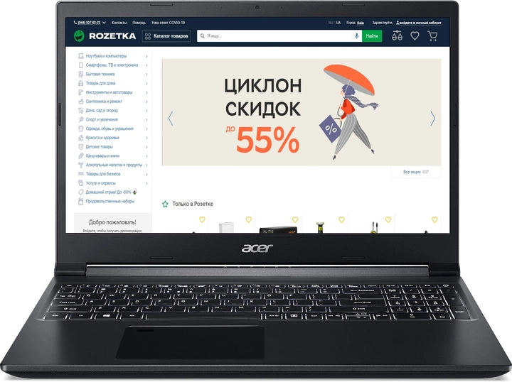

# Acer-Aspire-A715-75G 
# Характеристика ноутбука Aspire 7

## Огляд
Aspire 7 - це ноутбук з серії Aspire від компанії Acer.

    
    
    

## Характеристики 
- **Екран**: 
  - Діагональ: 15.6"
  - Тип: IPS
  - Частота оновлення: 60 Гц
  - Роздільна здатність: 1920x1080
  - Покриття: Матове

- **Відеокарта**:  
  - Виробник: Nvidia
  - Дискретна відеокарта: GeForce GTX 1650 Ti
  - Обсяг пам'яті: 4 ГБ
  - Тип: Дискретна

- **Накопичувачі даних**:
  - Обсяг SSD: 512 ГБ
  - Тип: SSD

- **Процесор**: 
  - Чотириядерний Intel Core i5-10300H (2.5 — 4.5 ГГц)
  - Покоління: 10-е Comet Lake

- **Оперативна пам'ять**:
  - Обсяг: 16 ГБ
  - Тип: DDR4
  - Можливість апгрейду: 2 слоти оперативної пам'яті

- **Підключення**:
  - Мережеві адаптери: Wi-Fi 802.11ax, Bluetooth 5.0, Gigabit Ethernet
  - Роз'єми: 1 x USB Type-C, 2 x USB 3.0, 1 x USB 2.0, HDMI, LAN (RJ-45), комбінований аудіороз'єм для навушників/мікрофона

- **Корпус**:
  - Вага: 2.15 кг
  - Колір: Чорний
  - Габарити: 363.4 x 254.5 x 23.25 мм

- **Батарея**:
  - Ємність: 48 Вт*год
  - Характеристики: 3-коміркова, 48 Вт*год

- **Маніпулятори**:
  - Тачпад

## Додатково
- З українською розкладкою
- З підсвіткою клавіатури

## Комплект постачання
Ноутбук, Адаптер живлення, Документація

## Країна реєстрації бренду
Китай (Тайвань)
[Відеоогляд ноутбука](https://drive.google.com/file/d/1ZTtmV92y4a55JR3FTOYnbwCGqhAa1HRH/view?usp=sharing)
